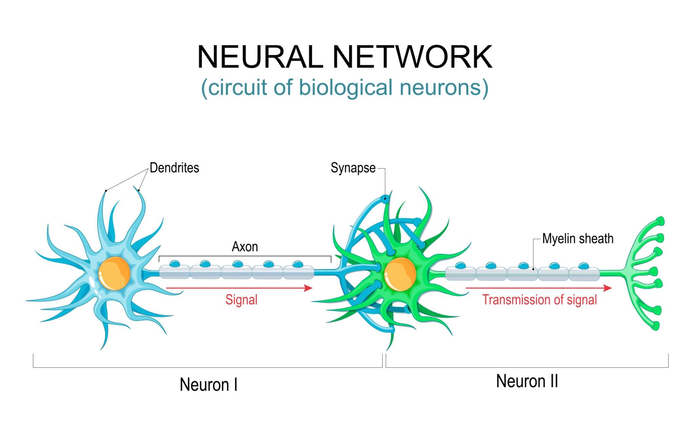

import ModuleBanner from '@site/src/components/ai/ai-banner';

<ModuleBanner />
### **Week 7: Introduction to Artificial Neural Networks (ANNs)**  
**Date: Saturday, 15 November 2025**

---

## 1.0 From Traditional ML to Deep Learning: A New Frontier

Good morning. So far, we have built some incredibly powerful models—Linear Regressors, SVMs, and even Random Forests. For these models to work well, we often have to perform careful feature engineering, which means using our human expertise to select and create the right input features.

But what if the model could learn the best features by itself, directly from the raw data? This is the core promise of Deep Learning, a subfield of machine learning that has revolutionized AI. The foundation of deep learning is the Artificial Neural Network (ANN), and that is our focus today.

---
## 2.0 The Biological Inspiration: The Neuron

The concept of an ANN is inspired by the most powerful computer we know: the human brain. The brain is made of billions of interconnected cells called neurons.

A biological neuron has three main parts:

- **Dendrites**: Receive input signals from other neurons.
- **Soma (Cell Body)**: Processes these incoming signals.
- **Axon**: Transmits an output signal if the combined input signals are strong enough to cross a certain threshold.

> **Analogy:** A neuron is a simple biological switch. It listens to many inputs, and if the collective "chatter" is loud enough, it "fires" and passes the message on. A network of these simple switches creates the incredible complexity of thought.

### 3.0 The Artificial Neuron: The Perceptron

The simplest form of an artificial neuron is the **Perceptron**, invented by *Frank Rosenblatt* in the 1950s. It is a **mathematical model** of a biological neuron.

**Components of a Perceptron:**

- **Inputs** `( x_1, x_2, ...)`: These are the feature values from our dataset.

- **Weights** `( w_1,w_2,...)`: Every input is multiplied by a weight. This weight signifies the importance of that input. A key idea in deep learning is that the network learns these weights.

- **Summation**: All the weighted inputs are summed together, and a bias term \( b \) is added. The bias is an extra learnable parameter that allows the neuron to be shifted left or right. The calculation is:

  $$
  w_1x_1 + w_2x_2 + \ldots + b
  $$

- **Activation Function**: The result of the sum is passed through an activation function, which decides the final output, whether the neuron "fires" and what signal it sends.
  A simple Perceptron uses a step function (e.g., if the sum is greater than 0, output 1; otherwise, output 0).

---
## 4.0 Multi-Layer Perceptrons (MLPs): Creating a Network

A single Perceptron is limited; it can only solve problems that are linearly separable. To tackle more complex problems, we **stack them together in layers** to form a **Multi-Layer Perceptron (MLP)**—a true Artificial Neural Network.

### Architecture of an MLP

* **Input Layer**
  Receives the raw data. There is typically one neuron for each feature in the dataset.

  > This layer doesn't perform any computation; it simply passes the data to the first hidden layer.

* **Hidden Layers**
  One or more intermediate layers between the input and output.

  > This is where the *"deep"* in Deep Learning comes from. These layers are responsible for learning increasingly abstract representations of the data.

* **Output Layer**
  Produces the final prediction.

  > The number of neurons depends on the task (e.g., one neuron for regression, or one neuron per class in classification).

---

### The Need for Non-linear Activation Functions

!!! tip "Why Not Just Use a Step Function?"
A simple step function doesn't allow deep networks to model complex, non-linear relationships. That's why we use **non-linear activation functions**.

#### Popular Activation Functions:

* **ReLU (Rectified Linear Unit)**
  Outputs the input if it's positive; otherwise, outputs 0.

  $$
  \text{ReLU}(x) = \max(0, x)
  $$

  ✅ Simple & efficient → Ideal for **hidden layers**

* **Sigmoid**
  Squashes input into the range (0, 1)

  $$
  \sigma(x) = \frac{1}{1 + e^{-x}}
  $$

  🔄 Common in **binary classification output layers**

* **Softmax**
  Converts scores into a probability distribution over multiple classes

  $$
  \text{Softmax}(z_i) = \frac{e^{z_i}}{\sum_{j} e^{z_j}}
  $$

  🎯 Used for **multi-class classification**

---

## 5.0 How Neural Networks Learn: A Conceptual Overview

So how does this network of neurons actually “learn” the correct weights? Through two main processes:

### 🎯 The Goal

Minimize a **loss function**, which quantifies how far off the predictions are from the actual labels.

---

### 🔁 The Learning Process

1. **Forward Propagation**

  * Input is passed forward through the layers
  * Output is generated

2. **Loss Calculation**

  * Compare predicted output to true label
  * Example: Mean Squared Error (MSE) for regression

   $$
   \text{MSE} = \frac{1}{n} \sum_{i=1}^{n}(y_i - \hat{y}_i)^2
   $$

3. **Backward Propagation (Backpropagation)**

  * Calculate how much each weight contributed to the error
  * Gradients are computed for all weights via **chain rule**

4. **Gradient Descent**

  * Update weights using gradients to **minimize the loss**
  * Performed using optimizers like `SGD`, `Adam`, etc.

   $$
   w := w - \eta \frac{\partial L}{\partial w}
   $$

   where $\eta$ is the learning rate

---

### 🎛️ Analogy

:::info Tuning a Massive Sound Mixer
Imagine a huge mixer board with thousands of knobs (weights).
- 🎧 You play a sound (forward pass)
- ❌ You hear something off (loss)
- 🔍 You identify which knobs were off (backpropagation)
- 🔧 You adjust them slightly (gradient descent)
- 🔁 You repeat until it sounds just right (training complete)
  :::
---

## 6.0 Deep Learning Frameworks

Building neural networks **from scratch** is not easy. That's why we use **Deep Learning Frameworks**:

| Framework      | Developed By               | Description                            |
| -------------- | -------------------------- | -------------------------------------- |
| **TensorFlow** | Google                     | Flexible, powerful, used in production |
| **PyTorch**    | Meta                       | Pythonic, dynamic, research-friendly   |
| **Keras**      | API (on top of TensorFlow) | High-level, simple, beginner-friendly  |

---
#### **6.0 Deep Learning Frameworks and Our Lab**

Building these networks from scratch is incredibly complex. Instead, we use powerful open-source libraries called **Deep Learning Frameworks**. The two most famous are **TensorFlow** (by Google) and **PyTorch** (by Meta).

We will be using **Keras**, which is a high-level, user-friendly API that is integrated into TensorFlow. It makes building complex neural networks feel as easy as stacking LEGO blocks.

In today's lab, you will use Keras to build your very first neural network to classify images of clothing.

